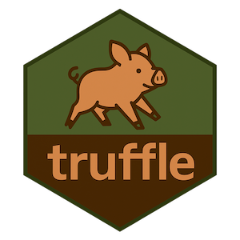

# psych-DS-ish

Standardization of project structures is both very useful and, let's face it, not very exciting or at the top of anyone's To Do list. I wanted to make it easier, both in my own research and to teach students good practices. 

{psychdsish} creates a standardized project skeleton that is compliant-ish with [psych-DS](https://psych-ds.github.io/) and also adds several features to improve reproducibility, such Quarto templates, a readme template, CC BY licence, and a .gitignore with reasonable defaults. 

It also has a validator function that lets users check that their project is still compliant with the standard and, if not, tells them how to rectify it.

## Data Standards

I am a big fan of the concept of standards, and the [psych-DS](https://psych-ds.github.io/) data standard specifically. Huge credit to Melissa Klein Struhl for leading it. 

*But*:

1. I am not *yet* convinced of the utility of psych-DS's .json requirement. a) .json files are a pain to create, and b) they are currently very rarely used in psychology workflows. So, personally, I'm not motivated to put the effort in to creating them or training my students to do so.
2. psych-DS is purposefully light-weight on what it requires users to do to be compliant. I'm ok being slightly more heavy handed given that my use case is a) my own projects and b) students in my R/tidyverse classes.
3. psych-DS focuses on *testing* compliance with the standard but not *assisting* the user in setting up a project that is compliant in the first place. Approached as a human-factors problem, this is likely to decrease uptake of psych-DS, given that tidying up a project after the fact is usually harder than providing a template up front.

## psych-DS-ish

psych-DS-ish is an R package that therefore: 1) drops the .json requirement, and 2) provides function to create skeleton project structures (`create_project_skeleton()`) or delete them (for testing purposes: `delete_project_skeleton()`) and validate a given project against psych-DS-ish rules (`validator()`). 

Does this contribute to Standards Proliferation? Yes, unfortunately. 


psych-DS-ish makes no attempt to define or maintain the standard itself, which is its weak point and psych-DS's strength. I have no desire to duplicate psych-DS's great work there; psych-DS-ish is intended to be a code tool not a full data standard. psych-DS-ish could be updated in future to bring it more in line with psych-DS, or psych-DS could distribute, fork, or otherwise make use of psych-DS-ish's skeleton generation tool. 

## Goal project structure

This is the project structure I use and teach:

``` text
github_repository_name/
├── .gitattributes
├── .gitignore
├── code/
│   ├── analysis.html
│   ├── analysis.qmd
│   ├── processing_study_1.html
│   ├── processing_study_2.html
│   └── ...
├── data/
│   ├── processed/
│   │   ├── study_1_processed_data.csv
│   │   ├── study_1_processed_codebook.xlsx
│   │   ├── study_2_processed_data.csv
│   │   ├── study_2_processed_codebook.xlsx
│   │   └── ...
│   ├── raw/
│   │   ├── study_1_raw_behavioraltask_data.csv
│   │   ├── study_2_raw_behavioraltask_data.csv
│   │   ├── study_1_raw_codebook.xlsx
│   │   ├── study_2_raw_codebook.xlsx
│   │   ├── study_1_raw_demographics_data.csv
│   │   ├── study_2_raw_demographics_data.csv
│   │   ├── study_1_raw_selfreports_data.csv
│   │   ├── study_2_raw_selfreports_data.csv
│   │   └── ...
│   └── outputs/
│       ├── plots/
│       │   ├── plot_1_self_reports.png
│       │   ├── plot_2_behavioral_task.png
│       │   └── ...
│       ├── fitted_models/
│       │   ├── fit_model_1.rds
│       │   ├── fit_model_2.rds
│       │   └── ...
│       ├── results/
│       │   ├── cor_matrix_study_1.csv
│       │   ├── cor_matrix_study_2.csv
│       │   └── ...
│       └── ...
├── LICENSE
├── methods/
│   ├── study_1/
│   │   ├── replication_instructions.docx
│   │   ├── study_1_labjs.json
│   │   ├── study_1_measures_and_procedure.docx
│   │   └── ...
│   └── study_2/
│       ├── replication_instructions.docx
│       ├── study_2_labjs.json
│       ├── study_2_measures_and_procedure.docx
│       └── ...
├── preregistration/
│   └── preregistration.docx
├── readme.md
├── reports/
│   ├── preprint/
│   │   ├── preprint.docx
│   │   └── ...
│   ├── presentations/
│   │   ├── conference_presentation.pptx
│   │   └── ...
│   └── ...
└── tools/
    ├── project_creator.qmd
    ├── project_validator.qmd
    └── ...
```


## Skeleton project structure created by `create_project_skeleton()`

This is the skeleton that  `create_project_skeleton()` creates:

```text
github_repository_name/
├── .gitattributes  # ignores .html files to help github detect R repos
├── .gitignore  # includes reasonable defaults
├── LICENSE  # CC BY 4.0
├── readme.md  # including overview, structure, reproduciblity instructions, license, suggested citation
├── code/
│   ├── analysis.qmd  # template created
│   └── processing.qmd  # template created
├── data/
│   ├── outputs/
│   │   ├── fitted_models/
│   │   ├── plots/
│   │   └── results/
│   ├── processed/
│   └── raw/
├── methods/
├── preregistration/
└── reports/
```


## Validation rules checked by `validator()`

A project is **psych-DS(ish)-compliant** if it follows all of the following rules:

| **File / Directory type** | **Allowed** | **Forbidden** |
|---------------------------|-------------|---------------|
| **Required directories**  | `code/`, `data/`, `data/raw/`, `data/processed/`, `data/outputs/`, `data/outputs/plots/`, `data/outputs/fitted_models/`, `data/outputs/results/`, `methods/`, `reports/`, `preregistration/` | Missing any of these directories |
| **Required files**        | `readme.md` (case-insensitive), license file (`LICENSE` preferred) | Missing either required file |
| **.qmd**, **.Rmd**, **.R** | In `code/` or `tools/` | Anywhere else |
| **.csv**, **.xlsx**, **.tsv**, **.dta**, **.sav**, **.feather**, **.rds** | In `data/` | Anywhere else (including `code/`) |
| **.pdf**                  | In `data/outputs/` or `data/raw/` | Anywhere else |
| **.png**                  | In `data/outputs/plots/` or `data/raw/` | Anywhere else |
| **.docx**                 | In `reports/`, `methods/`, `preregistration/`, `data/outputs/results/`, or `data/raw/` | Anywhere else |
| **.html**                 | In `code/` or `methods/` | Anywhere else |
| **Data-like files under `code/`** | None | Any `.csv`, `.xlsx`, `.tsv`, `.sav`, `.dta`, `.feather`, `.rds` |
| **.gitignore**            | Present and configured to ignore R session files, caches, large binaries | Absent |
| **Filenames**             | No spaces | Any filename containing spaces |


### Usage

Before running the 'project_creator.qmd' script:


<br>

After running the 'project_creator.qmd' script:


<br>

You can also use the function directly from the console without needing the .qmd file, if you know your project's file path. E.g., `psychdsish::create_project_skeleton(project_root = "~/git/my_project")`.

<br>

Results of `validator()` in a freshly generated project skeleton - note that some tests are not printed unless failed:


<br>

## License

© Ian Hussey (2025)

MIT licence

## Suggested citation
Hussey, I. (2025) psych-DS-ish: Tools to Create and Validate psych-DS-Inspired Project Structures. https://github.com/ianhussey/psychdsish
