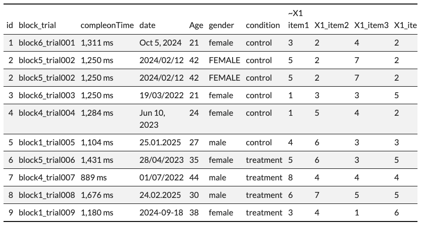

# truffle

{truffle} is an R package for teaching purposes. It allows you to create datasets with various known effects to be rediscovered (truffles), and then create data processing headaches that have to be solved (dirt). Users must then search for truffles among the dirt. 

Generated datasets can include demographics variables and item-level Likert responses. Known effects (truffles) can be buried in the data including differences in sum-score means between conditions, known correlations between the different outcomes' sum-scores, known Cronbach's alpha values for each scale, etc. Data can also be made messy, contain impossible values, or contain missingness, to create data processing challenges.

The package's functions are currently quite fragile: it is designed for a specific internal use case in our teaching and not (yet) highly flexible, nor does it contain tests or handle errors or make them visible. Currently it can only generate data for a single design: a between groups experiment with equal sample sizes.


## Usage

Generate data for the following:

- Item level Likert data (no choice)
- Between subjects experiment (control vs intervention) (2 conditions only, but can be renamed)
- Three outcome variables (arbitrary number)
- Known Cronbach's alpha for each scale (arbitrary number)
- Known number of items per scale (arbitrary number)
- Known number of Likert response options (1:k)
- Known correlations between the latent scale scores
- Known APPROXIMATE Cohen's d between the two conditions' latent scale scores (arbitrary number, but recovered value will differ due to reliability, distortion due to converting continuous data to Likert, etc.)

```{r}
library(truffle)

dat_truffle <- 
  generate_data_likert_two_conditions(n_per_condition = 200,
                                      factors  = c("X1_latent", "X2_latent", "X3_latent"),
                                      prefixes = c("X1_item", "X2_item", "X3_item"),
                                      alpha = c(.70, .75, .80),
                                      n_items = c(10, 7, 15),
                                      n_levels = 7,
                                      r_among_outcomes = c(0.50, .70, .40),
                                      approx_d_between_groups = c(0.50, 0.20, 1.00),
                                      seed = 42) 

View(dat_truffle)
```


Check that the sum scores conform to the predefined properties and that the item level data is approximately normal.

```{r}
check_generated_data(dat_truffle)
```


Generate data for the same study but make the demographics data mess, add missingness, and add impossible values to the item level data.

```{r}
dat_truffle_and_dirt <- dat_truffle |>
  add_demographics_messy() |>
  mutate(completion_time = generate_reaction_times(n = n())) |>
  add_missingness_messy(proportion_missing = .05) |>
  add_impossible_values(proportion_impossible = .04, replacement_value = 8) |>
  add_non_tidy_column(col = "block_trial") 

View(dat_truffle_and_dirt)
```

Output:




## TODO

Possible extensions:

- Other study designs, e.g., cross sectional for regressions studies; Mixed within between for 2X2 RCT
- Improve fragility. Many functions rely on columns being called "X1_..." Etc.
- Improve ecological validity of column names. Eg help users rename the generated variables to things like "BDI\_", "MADRS\_", etc


## License

© Ian Hussey (2025)

MIT licence

## Suggested citation
Hussey, I. (2025) truffle: Tools to create datasets with various known effects to be rediscovered. https://github.com/ianhussey/truffle
